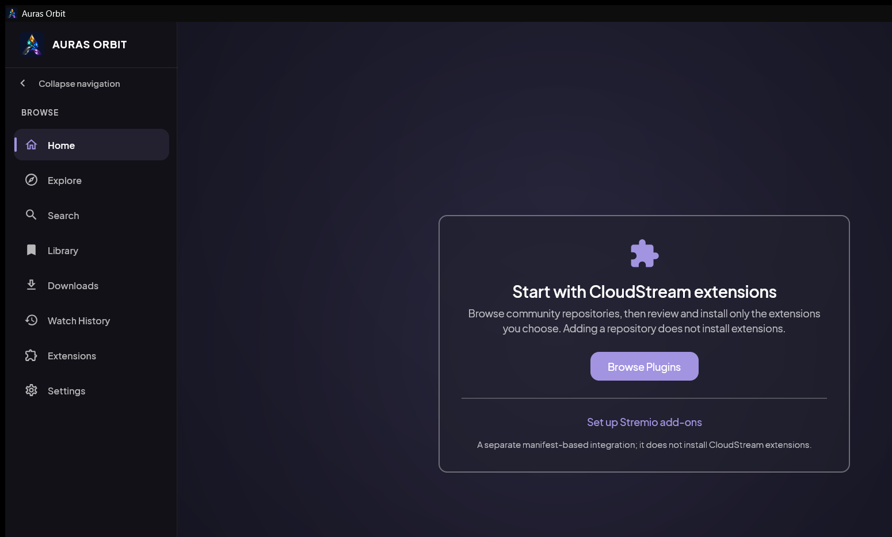
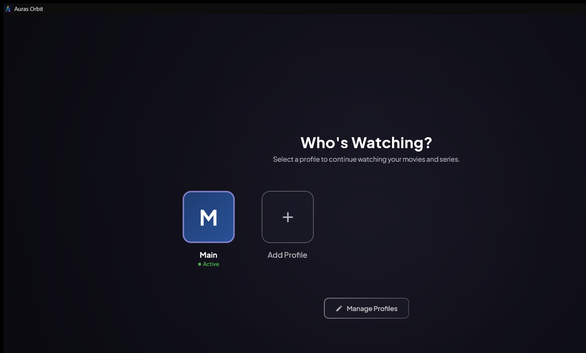

# Auras Orbit

Auras Orbit is a portable Windows desktop media client for CloudStream-compatible extensions. It gives you a native Kotlin/Compose desktop interface, local profiles and watch history, and MPV playback without an Android emulator.

Orbit does not host or distribute media streams or catalogs. You choose which extension repositories and sources to use, and availability depends on those providers.

**Current source version:** `0.2.0.00`<br>
**Development status:** Pre-alpha<br>
**Platform:** Windows 10 or 11, 64-bit<br>
**Downloads:** Published builds are listed on the [GitHub Releases page](https://github.com/SMRiaz-SA/Auras-Orbit/releases)

## Navigate this guide

[What you get](#what-you-get) · [Visual tour](#visual-tour) · [Quick start](#quick-start) · [Playback requirements](#playback-requirements) · [Tracker accounts](#tracker-accounts) · [Privacy](#privacy) · [Build from source](#build-from-source)

## What you get

- Browse, search, and play titles through compatible extensions you install.
- Home shelves for discovery, recent activity, bookmarks, and provider-backed catalogs when an extension supplies them.
- Genre Browser and topic filters for providers that expose the supported catalog data.
- Local profiles, bookmarks, watch history, and playback progress.
- Native MPV playback with a WebView2-based player interface.
- Optional MAL, AniList, and Simkl accounts, including a connected Tracker Library and explicit editing of fields supported by each provider.
- Per-tracker playback-sync controls. External tracker accounts are optional.

Extensions are user-selected. Adding a repository makes its catalog available for review; it does not install every extension in that repository.

## Visual tour

These screenshots were captured from the running desktop application using a clean local demo state. The Home image shows the first-run onboarding card before an extension repository has been configured; the profile image shows Orbit's local profile selector.





## Quick start

Download the portable ZIP or Windows installer from the [GitHub Releases page](https://github.com/SMRiaz-SA/Auras-Orbit/releases) when a build is published. The `main` branch contains source code, not a ready-to-run application package.

1. Extract the portable ZIP to a folder you control.
2. Keep `Auras-Orbit.exe`, the `app` folder, and the `runtime` folder together.
3. Start `Auras-Orbit.exe`.
4. Choose or create a local profile.
5. Open **Extensions**, add a repository you trust, and install only the providers you want to use.
6. Return to **Home** or **Explore** to browse. Use **Library** for bookmarks and local history.

The portable folder stores the application runtime and legal notices only. Your profiles, settings, extension files, credentials, watch history, and bookmarks are created in the app's data location at runtime; they are not part of the public source or portable deliverables.

## Playback requirements

Orbit includes its MPV native library in the portable package. Windows must provide the Microsoft Edge **WebView2 Evergreen Runtime** for the embedded player interface. WebView2 is an app component, not the Edge browser, and it does not change your default browser.

If Orbit reports that WebView2 is missing, install the [Evergreen Bootstrapper](https://developer.microsoft.com/microsoft-edge/webview2/#download-section) while online, or the x64 Evergreen Standalone Installer on an offline PC. Return to Orbit and choose **Check again after installing**; restart Orbit if the player still cannot start.

## Tracker accounts

MAL, AniList, and Simkl are optional integrations. Connect an account from **Settings → Accounts**, then open **Library → Tracker Library** to search and filter the connected list. Orbit only submits fields that the selected provider exposes, keeps rejected values unchanged, and refreshes the displayed entry after an accepted save.

Provider APIs can reject or ambiguously report a change. A rejected or uncertain provider response is shown as such; it is not treated as a successful write.

## Privacy

Orbit keeps profiles, local history, bookmarks, settings, extension data, and tracker credentials in local application data. Do not copy those folders into a bug report or source archive. The project's portable packaging checks intentionally exclude profile databases, account identities, watchlist titles, credentials, tokens, and other private app data.

## Build from source

Source builds require Git with submodules, JDK 21, PowerShell 7, and an internet connection to retrieve the hash-pinned native build tools and MPV development package. The MPV runtime binary is downloaded and verified for packaging; it is not stored in Git.

```powershell
git clone --recursive https://github.com/SMRiaz-SA/Auras-Orbit.git
cd Auras-Orbit
pwsh -File .\.github\scripts\build-local-deliverables.ps1
```

The script runs formatting checks, compilation, tests, native tests, and distribution verification on your computer. It creates one versioned portable ZIP and one source ZIP under `desktop-app/build/outputs/`. The portable application tree is written to `desktop-app/build/compose/binaries/main/app/Auras-Orbit/` and includes the WebView2 SDK and required license/provenance notices under `legal/`.

The Gradle wrapper pins its version and distribution checksum. Local Maven repositories are disabled unless explicitly enabled with `-PuseMavenLocal=true`. Set `APP_VERSION` in `gradle.properties` to change the app version; installer version metadata is generated under `desktop-app/build/generated/installer/`.

## License and support

Auras Orbit is distributed under the [GNU GPL v3](LICENSE). See [NOTICE.md](NOTICE.md) and [THIRD-PARTY-NOTICES.md](THIRD-PARTY-NOTICES.md) for attribution and dependency notices. The project is independent and is not affiliated with the Android CloudStream project.

For bugs and feature requests, use the project's [GitHub issue tracker](https://github.com/SMRiaz-SA/Auras-Orbit/issues). Users are responsible for the extensions and media sources they choose to use.
