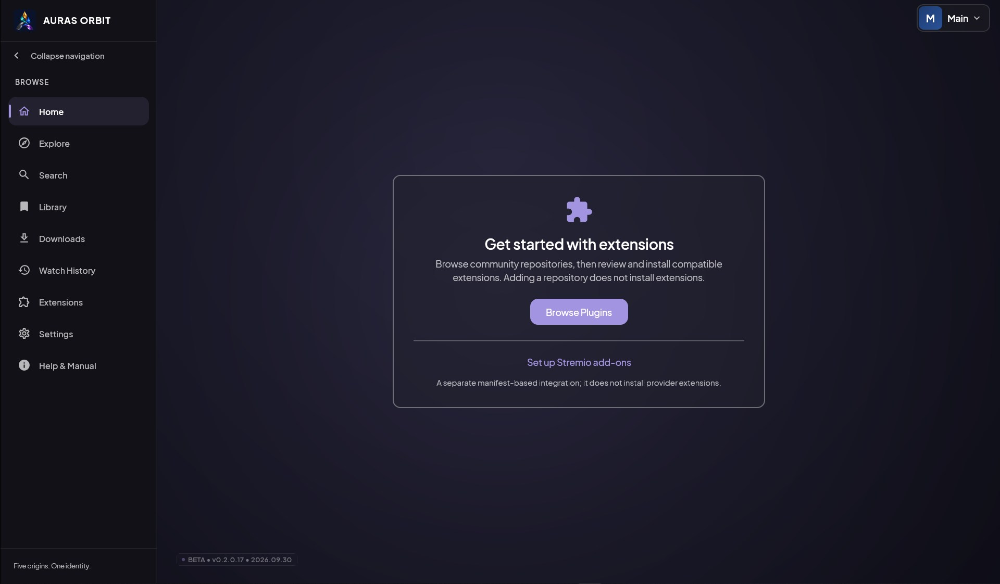
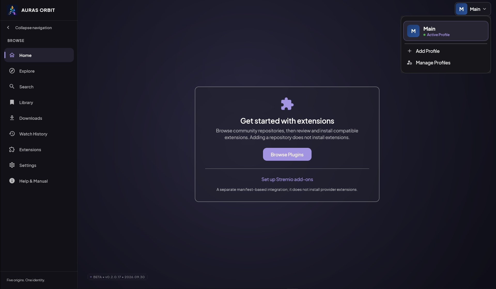
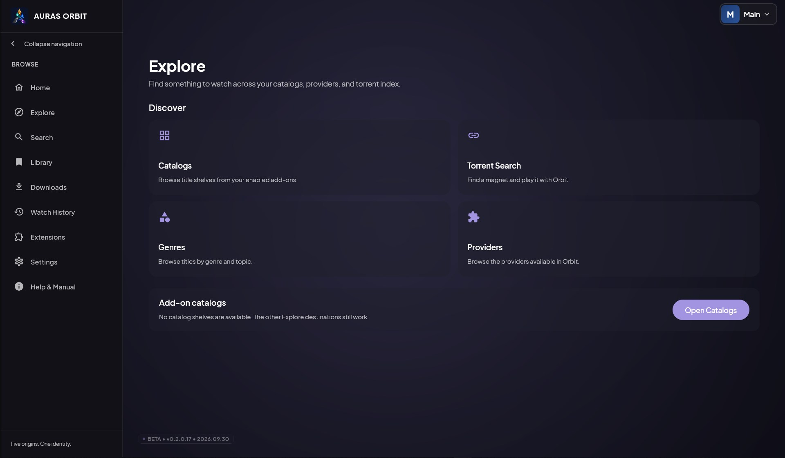

# Auras Orbit

### Your extensions. Your watchlist. Your screen.

Auras Orbit brings the providers you choose into one Windows desktop library. Browse add-on catalogs, find something to watch, play it on your PC, and return to your own progress later. Build a home screen that feels personal, switch between local profiles, and keep bookmarks and watch history close at hand.

Auras Orbit is an independent client. It does not host media or curate provider catalogs. You choose which extensions and add-ons to use, and their catalogs, links, and availability determine what you can find.

**Current version (desktop and Android):** Beta **0.2.0.24** 
**Source build date:** 2026-10-07 
**Platform:** Windows 10 or 11, 64-bit; Android beta APK 
**Downloads:** Windows installer and portable ZIP plus Android APK on the [GitHub Releases page](https://github.com/SMRiaz-SA/Auras-Orbit/releases) 
**Changelog:** [Release history](CHANGELOG.md)

## Navigate this guide

[Why Orbit](#why-orbit) · [Visual tour](#visual-tour) · [Quick start](#quick-start) · [Make it yours](#make-it-yours) · [Extension settings](#extension-settings) · [Browse and discover](#browse-and-discover) · [Playback and torrents](#playback-and-torrents) · [Profiles and privacy](#profiles-and-privacy) · [Build from source](#build-from-source)

## Why Orbit

Auras Orbit gives your chosen extensions a desktop home, with the discovery, playback, and library tools gathered in one app.

- **Bring your own providers.** Add repositories, review the extensions they offer, and install the ones you want. Browse and search through the providers enabled in your profile.
- **Pick up where you left off.** Keep playback progress and watch history in your local profile. Save titles to your library so they are easy to find again.
- **Make Home useful to you.** Return to in-progress titles, browse discovery shelves, and use a spotlight carousel when your enabled sources provide featured or trending items.
- **Explore from one dashboard.** Open add-on catalogs, genres, providers, or Torrent Search from the Explore screen.
- **Watch on your desktop.** Use Orbit's built-in MPV player or choose VLC as an external player. Tune the app's appearance and playback settings to suit your setup.
- **Keep your profiles on your PC.** Profiles, bookmarks, settings, and history are stored locally. There is no separate Auras watch-tracking account.

What appears in Orbit depends on the extensions and add-ons you choose. Providers may require their own setup, and their catalogs and availability can change.

## Visual tour

## Quick start

Download the portable ZIP or Windows installer from the [GitHub Releases page](https://github.com/SMRiaz-SA/Auras-Orbit/releases) when a build is published. The **main** branch contains source code, not a ready-to-run application package.

1. Extract the portable ZIP to a folder you control.
2. Keep **Auras-Orbit.exe**, the **app** folder, and the **runtime** folder together.
3. Start **Auras-Orbit.exe** and choose or create a local profile.
4. Open **Extensions**, add a repository you trust, and install the providers you want to use.
5. Visit **Home** to browse your enabled sources, or open **Explore** for catalogs, genres, providers, and Torrent Search.
6. Save titles to your **Library** and return to your history or in-progress shows when you're ready.

The portable folder contains the application runtime and legal notices. Your profiles, settings, extension files, credentials, watch history, and bookmarks are created in the app's data location at runtime; they are not included in the public source or portable deliverables. Standard Windows installs use **%APPDATA%\AurasOrbit**. Portable copies store data in **AurasOrbitData** beside the app.

## Make it yours

Orbit includes controls for shaping both the look of the app and the way its main screens work.

- Choose a theme, background palette, accent color, or local wallpaper.
- Set a custom font and adjust the app's overall UI scale.
- Choose a Home spotlight style and decide whether Continue Watching appears at the top of the feed.
- Reorder navigation buttons, hide optional tabs, and move the navigation dock to a side that suits your display.
- Manage separate profiles with their own library activity and watch progress.

Appearance options are under **Settings → Appearance**. Create and manage profiles from the profile selector. The built-in **Help & Manual** explains the app's screens and setup.

### Extension settings

Orbit renders declared AndroidX preferences as desktop controls for supported setting types, including switches, text, lists, multi-select lists, and seek bars. Changes are staged until you choose **Apply**. The extension reloads after its settings are saved.

Some extensions provide custom Android screens instead of standard preferences. Orbit supports those only when a desktop adapter is available. If a screen has no adapter, Orbit reports that it is unsupported instead of guessing settings from internal plugin data.

## Browse and discover

The **Explore** dashboard brings together four destinations:

- **Catalogs** displays shelves from enabled Stremio add-ons. Orbit reads the search and filter fields each catalog declares and sends supported requests to that add-on.
- **Genres** and **Providers** help you browse the categories and sources exposed by enabled extensions and add-ons.
- **Torrent Search** searches the Magnetz service for title matches and hands playable magnet results to Orbit's torrent playback path.

Catalog results can be checked against enabled Stremio stream add-ons using the media ID supplied by the catalog. For series, Orbit looks for episode IDs from metadata add-ons and asks you to choose an episode when available; it does not guess an episode ID when one is missing. Results depend on what the selected add-ons support, including their declared resource, type, and ID-prefix formats. Some add-ons require a configured manifest URL; Orbit does not host their setup pages.

## Playback and torrents

Orbit includes its MPV native library in the portable package. You can use MPV inside Orbit or select VLC as an external player when VLC is installed. VLC is optional and must be installed separately; Orbit detects a standard VLC installation or a VLC executable on PATH and launches it in its own window. Some links that need additional request headers are routed to MPV for compatibility. When using VLC, control playback in VLC itself; Orbit's pause and seek controls are not currently connected to the external player. MPV settings include audio adjustments such as equalization, volume normalization, and audio delay.

Windows must provide the Microsoft Edge **WebView2 Evergreen Runtime** for Orbit's embedded player interface. WebView2 is an app component, not the Edge browser, and it does not change your default browser.

If Orbit reports that WebView2 is missing, install the [Evergreen Bootstrapper](https://developer.microsoft.com/microsoft-edge/webview2/#download-section) while online, or the x64 Evergreen Standalone Installer on an offline PC. Return to Orbit and choose **Check again after installing**; restart Orbit if the player still cannot start.

### Optional torrent streaming

Magnet links from compatible providers and Explore's Torrent Search can be streamed through Orbit's TorrServer engine. Turn on **Settings → Network → Enable P2P Torrent Streaming** to use it; the feature is off by default. If TorrServer is not installed, Orbit downloads it the first time you play a torrent.

Torrent playback connects to other peers in a swarm, so your public IP address is visible to those peers. Only play content you are authorized to access.

## Profiles and privacy

Auras Orbit stores profiles, playback progress, watch history, bookmarks, settings, extension data, and subtitle-service credentials in local application data. Each profile keeps its own library activity on the device. External watch-tracking accounts and playback syncing are not supported.

From **Library → Library file**, export the active profile's saved titles and episode progress as an `.orbitlib` file, or import one into a profile. Imports add missing titles and keep the newer episode progress; matching saved titles are left unchanged and no library entries are deleted. Library files contain title and provider URLs, statuses, and playback progress. They do not contain credentials, extension data, settings, downloads, or screenshots. Store exported files privately.

Catalog browsing and stream lookup send search text or media IDs to the extensions and Stremio add-ons selected for those requests. Torrent Search sends the title query to the Magnetz search API. Avoid copying app-data folders into bug reports or source archives: they can contain profile databases, account identities, watchlist titles, credentials, and tokens. Orbit's portable packaging checks intentionally exclude this private app data.

## Build from source

Source builds require Git, JDK 21, PowerShell 7, and an internet connection to retrieve the hash-pinned native build tools and MPV development package. The full pinned CloudStream-compatible source is included in **android-reference/** with its upstream license. The MPV runtime binary is downloaded and verified for packaging; it is not stored in Git. Building the Windows installer also requires Inno Setup 6.

For a local portable build to test, run:

~~~powershell
.\gradlew.bat :desktop-app:createDistributable
~~~

The app folder is written to **desktop-app/build/compose/binaries/main/app/Auras-Orbit/**. Keep **Auras-Orbit.exe**, **app/**, **runtime/**, and **legal/** together. Add an empty **portable.txt** beside the executable to keep test data in **AurasOrbitData/** beside the app. This local test build does not create an archive.

For release packaging, the helper script below runs formatting checks, compilation, tests, native tests, and distribution verification. It creates versioned deliverables under **desktop-app/build/outputs/**.

~~~powershell
git clone https://github.com/SMRiaz-SA/Auras-Orbit.git
cd Auras-Orbit
pwsh -File .\.github\scripts\build-local-deliverables.ps1
~~~

The local packaging helper builds and verifies the portable app, Windows installer, Android APK, and a source ZIP containing the public source tree. It checks formatting, compilation, JVM and native tests, and packaged deliverables. The CloudStream-compatible library and Orbit's episode-date fixes are included directly in **android-reference/**; no submodule setup or patch step is needed.

GitHub Actions CI runs on pushes to **main**, pull requests, and manual dispatches using GitHub-hosted Windows x64 runners. It checks formatting, runs JVM and native tests, builds and verifies a test portable app, and uploads test reports. The separate release workflow runs for version tags beginning with **v** and attaches the Android beta APK.

The portable application tree includes the WebView2 SDK and required license and provenance notices under **legal/**. The Gradle wrapper pins its version and distribution checksum. Local Maven repositories are disabled unless explicitly enabled with **-PuseMavenLocal=true**. Set **APP_VERSION** in **gradle.properties** to change the app version; installer version metadata is generated under **desktop-app/build/generated/installer/**.

### Android build foundation

The Android app has a separate Gradle root in **android-reference/** and does not build the Windows application. It starts from the pinned CloudStream Android source for extension compatibility. The Android package ID for this beta APK is **com.auras.orbit.debug**. Android reads **APP_VERSION** from the repository-root **gradle.properties**, so the APK and desktop use the same version without a second version setting. The downloadable APK is built from the **stableDebug** variant and uses Android's debug signing key.

With an Android SDK installed, build the local stable debug APK from PowerShell:

~~~powershell
cd .\android-reference
.\gradlew.bat :app:assembleStableDebug
~~~

 This command builds locally; it does not publish an APK or write to GitHub.

## Acknowledgements

Auras Orbit builds on source code and extension APIs from the [CloudStream project](https://github.com/recloudstream/cloudstream), adapted for Windows desktop compatibility. Thank you to the CloudStream maintainers and contributors, and to the teams behind [Kotlin](https://kotlinlang.org/), [Compose Multiplatform](https://www.jetbrains.com/compose-multiplatform/), [MPV](https://mpv.io/), and the many libraries Orbit depends on.

For full attribution and license details, see [NOTICE.md](NOTICE.md) and [THIRD-PARTY-NOTICES.md](THIRD-PARTY-NOTICES.md).

## License and support

Auras Orbit is distributed under the [GNU GPL v3](LICENSE). See [NOTICE.md](NOTICE.md) and [THIRD-PARTY-NOTICES.md](THIRD-PARTY-NOTICES.md) for attribution and dependency notices. The project is independent and is not affiliated with the Android CloudStream project.

For bugs and feature requests, use the project's [GitHub issue tracker](https://github.com/SMRiaz-SA/Auras-Orbit/issues). Users are responsible for the extensions and media sources they choose to use.
